# Stechoq RFID Suite

A native Android app for scanning UHF RFID tags on warehouse handhelds and pushing the results to
a warehouse-management API. Built for **Chainway C72** and **Zebra** (MC33 / MC3300x) devices from
a single APK — the same build installs on either brand of hardware.

This document is both a user guide (what every screen and setting does) and a developer reference
(project layout, build, and release process).

## Table of contents

- [Overview](#overview)
- [First launch: choosing your device](#first-launch-choosing-your-device)
- [The Scan screen](#the-scan-screen)
- [Signal Quality](#signal-quality)
- [Barcode mode](#barcode-mode)
- [Sending scans: WO vs Register mode](#sending-scans-wo-vs-register-mode)
- [Background scanning & the floating bubble](#background-scanning--the-floating-bubble)
- [Local CSV backup](#local-csv-backup)
- [Self-update](#self-update)
- [Settings reference](#settings-reference)
- [Language](#language)
- [Troubleshooting](#troubleshooting)
- [For developers](#for-developers)

## Overview

- Continuous multi-tag UHF inventory scanning, hold-to-scan via the handheld's physical trigger
- Live tag table: EPC, read count, a plain-language Quality indicator, new-vs-already-seen badge
- A second scan mode for 1D/2D barcodes, switchable in Settings — the same trigger drives a
  barcode engine instead of the RFID reader, and each decode sends immediately
- One shared payload format posted to your API regardless of mode (WO or Register)
- Works whether the app is in the foreground or backgrounded — a small floating status bubble
  keeps the operator informed while browsing something else
- Self-updates over the air from GitHub Releases, no cable required after first install
- English and Indonesian, switchable anytime, applied instantly across every screen

## First launch: choosing your device

The very first time the app opens on a handheld, it asks which hardware it's running on:

- **Chainway C72** — built-in UHF reader, accessed via Chainway's `DeviceAPI` SDK
- **Zebra** — built-in UHF reader on MC33 / MC3300x handhelds, accessed via Zebra's RFID API3 SDK

This choice is remembered for that device (stored separately from the rest of Settings, so
"Reset" never accidentally changes it) and decides which vendor backend the app talks to for the
rest of its life on that unit. To change it, reinstall the app or clear its data.

## The Scan screen

The main screen, and the only one an operator needs day to day.

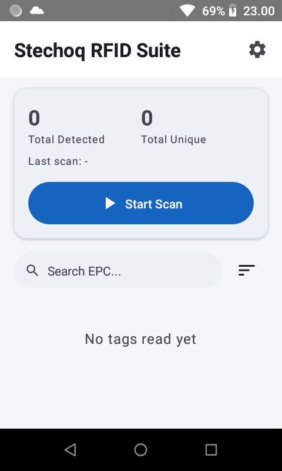

- **Summary card** — total tags detected (raw reads) and total unique tags this session, plus the
  time of the last completed scan
- **Start Scan / Stop Scan** — tap, or hold the physical trigger; releasing the trigger stops the
  scan the same as tapping Stop
- **New Scan vs Continue** — once a session has tags, the button row splits: **New Scan** clears
  everything and starts fresh, **Continue** keeps existing tags and resumes scanning (useful for
  scanning a large area in passes without losing earlier reads)
- **Send status** — after a scan stops, the collected tags post to your API automatically; a
  banner shows Sending → Sent (n tags) or a Retry button on failure

- **Tag list** — sorted and searchable; each row shows the EPC, read count (`R:`), a **Quality**
  label, and a **NEW** / **EXISTING** badge (whether this tag was already in the list before the
  current scan session started). Tap the copy icon on a row to copy its EPC.
- **Search & sort** — filter by EPC substring; sort by most recent, EPC (A–Z), read count, or Quality

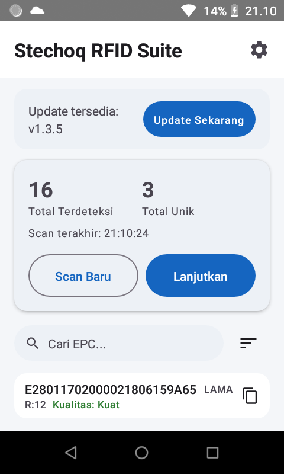

## Signal Quality

RSSI, antenna number, and last-seen time used to be shown directly on every row — operators found
the raw dBm number meaningless without training, so it's been replaced with a plain **Quality**
label: **Strong**, **Medium**, or **Weak**, color-coded green/amber/red.

<table>
<tr>
<td><br/><sub>Strong (green)</sub></td>
<td>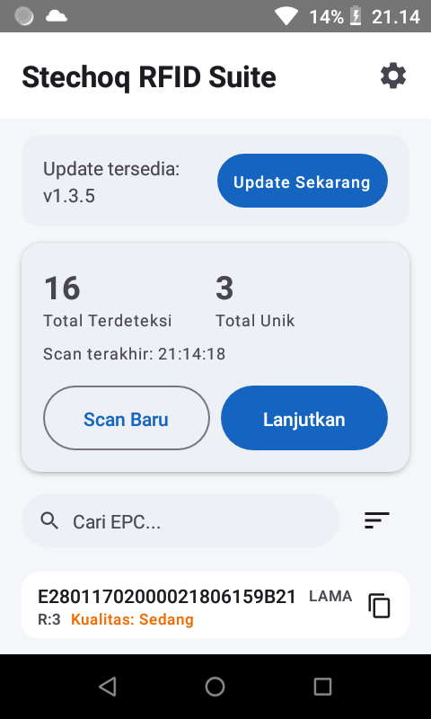<br/><sub>Medium (amber)</sub></td>
<td>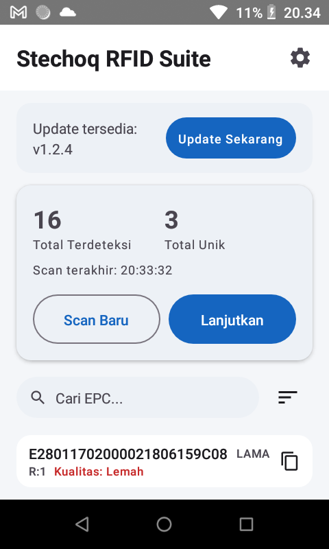<br/><sub>Weak (red)</sub></td>
</tr>
</table>

The classification is computed from the tag's RSSI and read count together — a tag caught only
once is treated as one tier weaker than its RSSI alone would suggest, since a single read hasn't
demonstrated a stable link the way repeated reads have. The exact thresholds are intentionally not
documented here or exposed anywhere in the app; see the comment on `TagQuality.kt` in the source
if you need to tune them.

## Barcode mode

A second scan mode, alongside RFID, for reading 1D/2D barcodes instead of UHF tags. Switchable in
Settings → Scan Mode (defaults to RFID). Selecting Barcode changes what the physical trigger does
and gives the Scan screen a distinct purple-accented layout so it's obvious at a glance which mode
is active:

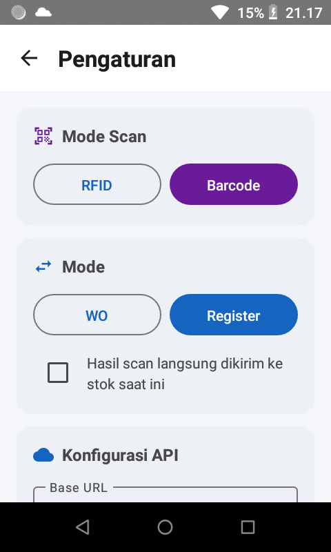

- **The trigger drives the barcode scanner, not the RFID reader** — hold it to read a barcode the
  same way you'd hold it for an RFID scan
- **Each decoded barcode sends immediately**, one at a time, using the exact same payload shape as
  an RFID batch send — there's no "stop scan" step to collect a batch first
- Every scan shows in a list with its send status: **Sending → Sent** or **Failed**

<table>
<tr>
<td>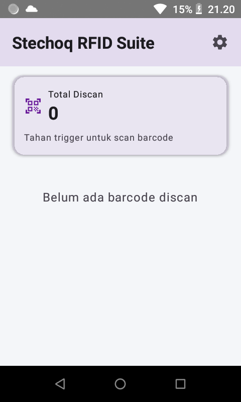<br/><sub>Waiting for a scan</sub></td>
<td>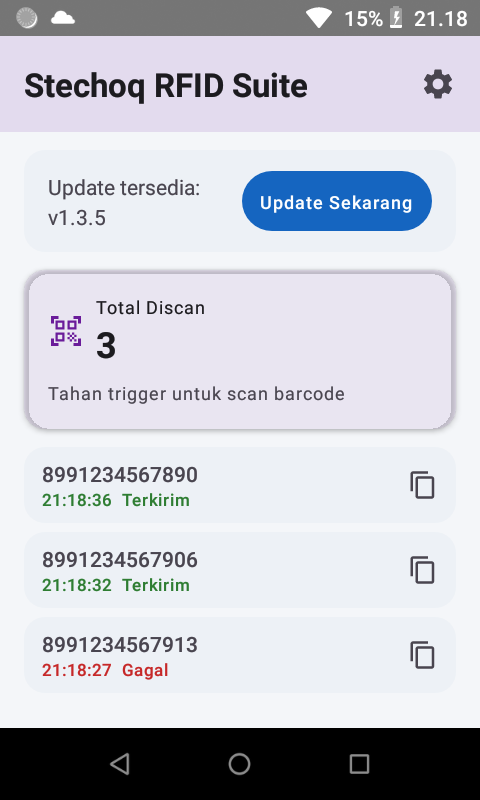<br/><sub>Scanned codes with status</sub></td>
</tr>
</table>

Because RF transmit power has no meaning for barcode scanning, the Power section in Settings is
hidden entirely while Barcode mode is selected (see [Settings reference](#settings-reference)).

Barcode scans are **not** written to the local CSV backup — that safety net covers RFID sessions
only, since each barcode already posts individually and immediately instead of batching.

## Sending scans: WO vs Register mode

Switchable in Settings → Mode. Both modes post to the **same endpoint** with the **same JSON
shape** — a `mode` field in the payload (`"wo"` or `"register"`) is what tells your backend which
flow it is. See [API payload](#api-payload) for the exact fields.

A checkbox next to the toggle, *"Scan result is sent to current stock"*, is available in **both**
modes — when checked, the payload's `opname` field is `true`, telling the backend this scan should
also post straight to current stock.

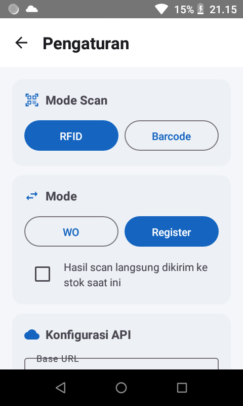

## Background scanning & the floating bubble

Off by default. Turn it on in Settings → Background Scanning, and two things change:

1. **The physical trigger keeps working even when the app isn't the foreground app** — hold it
   while browsing in Chrome, checking the WMS in a browser tab, or anything else, and it still
   scans. With this off, a trigger press does nothing unless the app is actually on screen.
2. **A small floating bubble appears** over whatever else is on screen — drag it anywhere, tap it
   to jump back into the app. Its color tells you the scan state at a glance, no text needed:

   | Color | Meaning |
   |---|---|
   | Gray | Idle — not currently scanning |
   | Blue | Scanning — shows the live unique-tag count in the middle |
   | Green | Last scan sent successfully — shows how many tags were sent |
   | Red | Last scan failed to send |

<table>
<tr>
<td>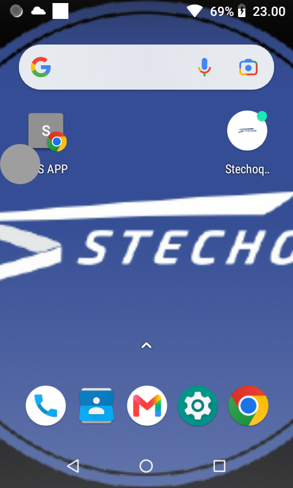<br/><sub>Idle, over the home screen</sub></td>
<td>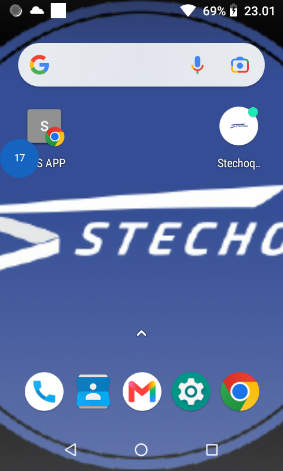<br/><sub>Scanning, live count</sub></td>
<td>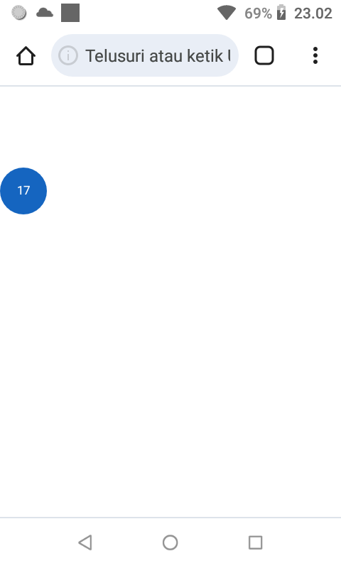<br/><sub>Floating over Chrome</sub></td>
</tr>
</table>

Turning this on requires Android's "Display over other apps" permission — the app prompts for it
the first time you enable the toggle, one approval per device.

Because this keeps a small foreground service alive while backgrounded, you'll also see a
low-priority "Background scanning active" notification in the status bar for as long as it's
running (standard Android requirement for any app doing work while backgrounded — it can't be
turned off independently of the feature itself).

## Local CSV backup

On by default, in Settings → Local Backup. Every time a scan session stops (successfully or not),
the full tag list for that session is written to a CSV file on the device, independent of whether
the send to your server succeeded — a safety net for spotty warehouse WiFi.

Files land in `Android/data/com.example.chainwayrfidbridge/files/rfid_stc/` on the device's
storage (created automatically if it doesn't exist yet), named `scan_YYYYMMDD_HHMMSS.csv`, one
file per scan session with columns: `epc, first_seen, last_seen, read_count, antenna, rssi,
is_new`.

## Self-update

The app checks this repo's GitHub Releases for a newer version on every launch and every time it
returns to the foreground (throttled to at most once every 5 minutes). If a newer release exists,
a banner appears on the Scan screen:

1. **Update available: vX.Y.Z** → tap **Update Now** to download
2. Once downloaded, tap **Install** — this hands off to Android's standard package installer
3. The very first time on a given device, Android may show its own "allow installs from this app"
   permission screen — a one-time approval per device, not per update

No laptop, no cable, no manual APK transfer — see [Releasing](#releasing-fully-automated) for how
new versions get published in the first place.

## Settings reference

Every section, top to bottom, each with its own icon:

- **Scan Mode** — RFID / Barcode toggle described in [Barcode mode](#barcode-mode) above; the
  selected option's icon turns purple when Barcode is active
- **Mode** — WO / Register toggle, plus the "opname" checkbox described earlier (available in both)


- **API Configuration**
  - **Base URL** — editable dropdown, remembers anything you type
  - **Endpoint** — editable dropdown, defaults to the shared endpoint; independent of Mode
  - **Reader ID** — read-only, auto-derived from the device (`<model>-<short Android ID>`) so
    every handheld in a fleet gets a unique, human-readable ID with zero per-device setup
  - **Antenna** — editable dropdown

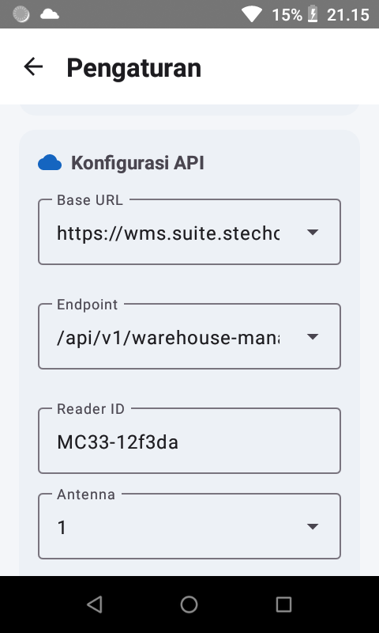

  - **Test & Get Data** — pings the configured Base URL and, in the same tap, fetches the **RR
    Type** and **Factory Code** lists from it (see below)
- **Register Configuration** — Maker Name and Initial Year are editable dropdowns that remember
  custom entries; **RR Type** and **Factory Code** are selection-only (no manual typing) and
  populated by the **Test & Get Data** button above from `{baseUrl}/api/v1/master/dropdown/rr-type/components`
  and `{baseUrl}/api/v1/master/warehouse-factory/` respectively — Factory Code shows "code - name"
  in the list but only the code is stored and sent. Both lists are cached on the device, so they
  stay populated across app restarts until the button is tapped again.

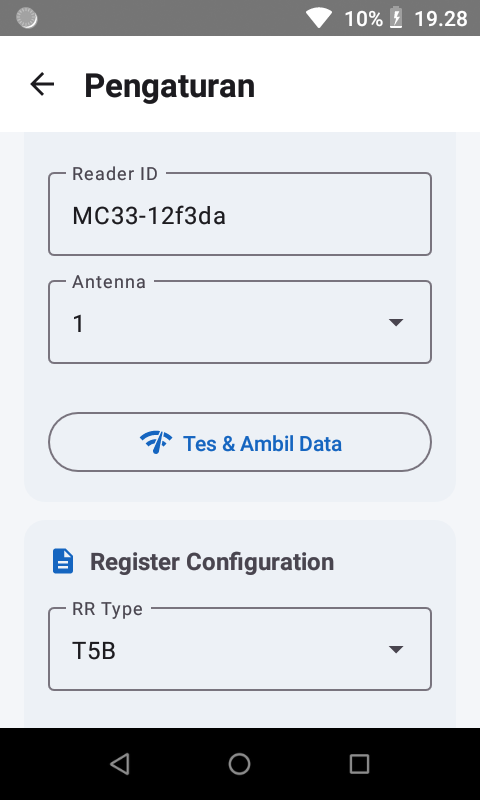

- **Power** — native range per vendor, not an abstracted scale: **Chainway 1–30 dBm**, **Zebra
  0–300** (matching Zebra's own 123RFID app's units directly). **Hidden entirely in Barcode mode**,
  since RF transmit power has no meaning there.

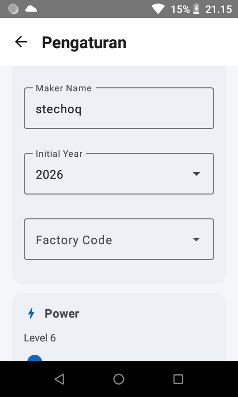

- **Sound** — beep on tag read, on/off, plus a volume slider when enabled

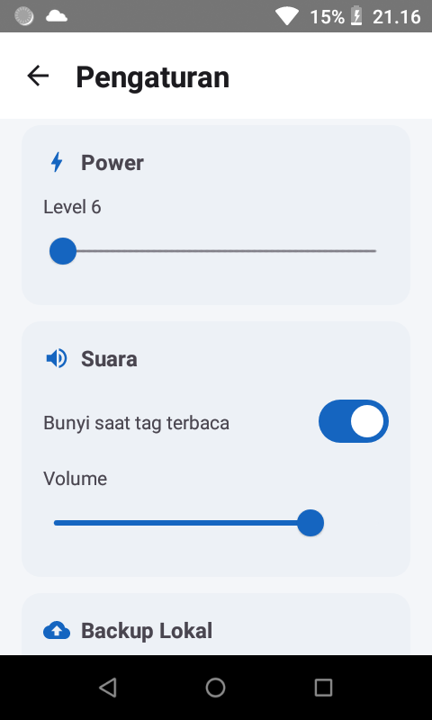

- **Local Backup** — the CSV toggle described above (RFID sessions only)
- **Background Scanning** — the floating-bubble toggle described above
- **Language** — English / Indonesian, applied instantly, independent of the rest of Settings

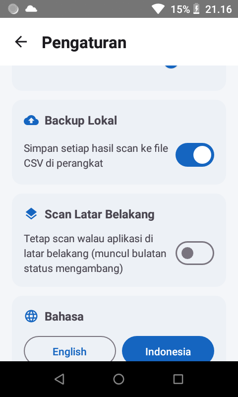

- **Reset** — clears everything above back to defaults (never touches device type or language)
- **Save** — validates and persists; the app's current version is shown just below this row

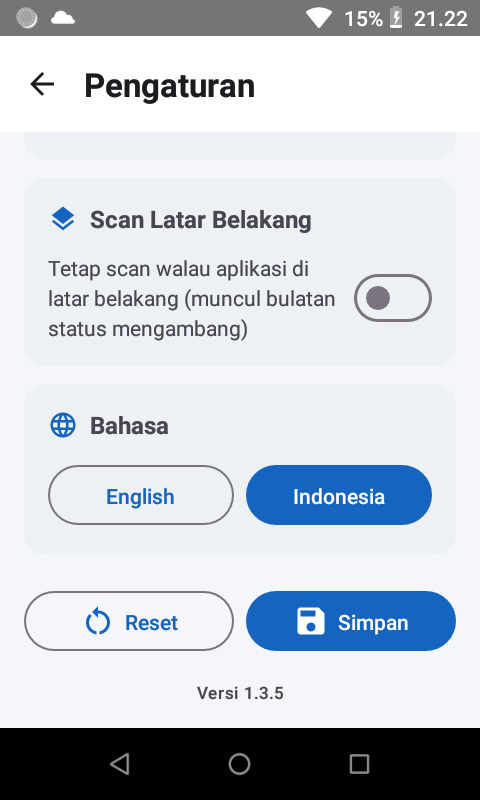

## Language

English and Indonesian, switchable anytime from Settings, defaulting to English on first install.
Every screen's text — including notifications and validation messages — comes from one shared
string table, so nothing drifts out of sync between languages.

## Troubleshooting

- **"RFID_CHARGING_COMMAND_NOT_ALLOWED" on Zebra** — some Zebra units refuse to start an RFID
  scan while they believe they're charging, which includes sitting in a powered USB/adb cradle for
  development. Not a bug — unplug and test normally.
- **Barcode laser fires alongside RFID on Zebra (in RFID mode)** — was a real bug (not just a
  DataWedge quirk): `ScanViewModel` used to call `ZebraBarcodeManager.connect()` unconditionally
  at startup, and `connect()` used to also configure *and* `SWITCH_TO_PROFILE` DataWedge's
  barcode-capable profile as a side effect — regardless of which Scan Mode was actually selected.
  An RFID-mode operator got that profile force-activated underneath them, undoing
  `ZebraReaderManager`'s own DataWedge-disable-on-RFID-mode logic. Fixed by moving that
  configure/activate step out of `connect()` into `setActive(active)`, called only when Barcode
  mode is actually selected (mirroring `RfidReaderManager.setInputMode`) — verified via logcat
  that RFID mode now sends zero DataWedge profile commands, and switching to RFID mode explicitly
  disables the scanner (`Status:DISABLED;ProfileName:null`). If it ever recurs on a specific unit
  despite that, it'd point to a genuine DataWedge profile issue on that handheld.
- **Update won't install on a device you tested with a local/manual build** — Android refuses to
  install an "update" with an equal-or-lower `versionCode` than what's already there. This only
  matters if you've been sideloading manual builds outside the normal CI pipeline.
- **Update download times out** — the in-app updater downloads the APK itself (a few MB) over
  whatever network the handheld has; on slow warehouse WiFi the first attempt can occasionally
  time out. Tapping Update Now again retries cleanly.
- **Barcode mode on Zebra: trigger scans but nothing shows up in the app** — the scan engine
  decoded successfully but DataWedge routed the result to a different profile's default keystroke
  output, which a focus-less Compose screen silently swallows. The app now force-activates its own
  DataWedge profile (`SWITCH_TO_PROFILE`) after configuring it, rather than relying on automatic
  foreground-app association — if this ever recurs, check the DataWedge app itself to confirm the
  `StechoqRFIDSuiteBarcode` profile exists, is enabled, and its Intent Output config matches
  `ZebraBarcodeManager.kt`.

## For developers

### Project layout

```
app/src/main/java/com/example/chainwayrfidbridge/
├── MainActivity.kt              # Nav host, language CompositionLocal, physical trigger key events
├── RfidBridgeApplication.kt     # Process-wide foreground/background watcher for the floating bubble
├── ScanViewModel.kt             # Scan session state, tag buffer, beep, CSV backup, send, self-update
├── Payload.kt                   # Unified WO/Register JSON body shape
├── data/
│   ├── ScanConfig.kt            # Persisted scan settings + validation
│   ├── ConfigRepository.kt      # SharedPreferences (resettable config vs. device-level prefs)
│   ├── DeviceType.kt            # Chainway | Zebra, incl. each vendor's native power range
│   ├── AppLanguage.kt           # EN | ID
│   ├── InputMode.kt             # RFID | Barcode, persisted per device
│   ├── TagQuality.kt            # Strong/Medium/Weak classification from RSSI + read count
│   ├── BarcodeScanRecord.kt     # One decoded barcode + its send status
│   └── TagRecord.kt
├── rfid/
│   ├── RfidReaderManager.kt     # Vendor-agnostic interface both backends implement
│   ├── ChainwayReaderManager.kt # RFIDWithUHFUART push-callback backend
│   └── ZebraReaderManager.kt    # RFID API3 backend; also owns DataWedge trigger handoff
├── barcode/
│   ├── BarcodeReaderManager.kt  # Vendor-agnostic barcode capture interface
│   ├── ChainwayBarcodeManager.kt# com.rscja.barcode.BarcodeDecoder push-callback backend
│   └── ZebraBarcodeManager.kt   # DataWedge profile + intent-output receiver
├── network/
│   ├── ApiClient.kt             # POSTs scanned tags/barcodes to the configured endpoint
│   └── UpdateClient.kt          # GitHub Releases version check + APK download
├── service/
│   ├── ScanStateBus.kt          # Shared scan-state mirror (Service has no ViewModel of its own)
│   └── FloatingScanService.kt   # Foreground service showing the background scan status bubble
└── ui/
    ├── DevicePickerScreen.kt    # First-launch vendor choice
    ├── ScanScreen.kt            # Main screen
    ├── SettingsScreen.kt        # Mode, API config, power, sound, background scan, language
    └── AppStrings.kt            # All user-facing strings, EN + ID
```

### Building locally

Requires the vendor SDKs, which are proprietary and **not included in this repo**:

1. Chainway UHF SDK `.aar` (e.g. `DeviceAPI_ver*.aar`) → drop into `app/libs/`
   (see `app/libs/README.txt`, or get it from https://www.chainway.net/Support/Info/10)
2. Zebra RFID API3 SDK `.aar` (e.g. `API3_LIB-release-*.aar`) → also into `app/libs/`

Then a standard Gradle build:

```bash
./gradlew testReleaseUnitTest assembleRelease
```

Output lands at `app/build/outputs/apk/release/app-release-unsigned.apk` — sign it before
installing (a debug keystore is fine for internal handheld deployment):

```bash
zipalign -f -p 4 app-release-unsigned.apk app-release-aligned.apk
apksigner sign --ks ~/.android/debug.keystore --ks-pass pass:android \
  --key-pass pass:android --out app-release-signed.apk app-release-aligned.apk
adb install -r app-release-signed.apk
```

`targetSdk` is deliberately held at 32 (see the comment in `app/build.gradle`) — the Zebra SDK
registers a broadcast receiver in a way that Android turns into a hard crash once `targetSdk`
reaches 33, only on Android 13+ devices. This is a sideloaded app, never published to Play
Store, so there's no policy reason to target higher.

`versionCode`/`versionName` fall back to `2`/`"1.1"` for a local build like the one above, but CI
always overrides both via `-PappVersionCode=`/`-PappVersionName=` — see below.

### Releasing (fully automated)

`.github/workflows/release.yml` builds, tests, signs, tags, and publishes a GitHub Release on
every push to `main` — no manual build or upload step, ever. Each run:

1. Computes a version from the run number (`versionCode = <run number> + 1000`, `versionName =
   1.4.<run number>`) — always increasing, which Android requires for an update to install over
   the previous version, without ever hand-editing `build.gradle`. The `+1000` offset keeps CI's
   versionCode safely clear of anything used during local/manual testing.
2. Builds and unit-tests the release APK with that version baked in.
3. Signs it with the same keystore every already-deployed handheld was signed with — using a
   different key would make every existing install reject the update.
4. Tags the commit `vX.Y.Z` and publishes a GitHub Release with the signed APK attached.

Deployed handhelds pick it up automatically per [Self-update](#self-update) above.

#### One-time CI setup

Vendor SDKs are proprietary and too large for a GitHub Actions secret (64 KB limit), so they're
restored from a dedicated release instead of committed to the repo:

```bash
gh release create vendor-sdks \
  app/libs/DeviceAPI_ver20251103_release.aar \
  app/libs/API3_LIB-release-2.0.1.29.aar \
  --title "Vendor SDKs (CI only)" \
  --notes "Restored into app/libs/ by release.yml — not part of the app's own release history."
```

The signing keystore *is* small enough for a secret — add it as `RELEASE_KEYSTORE_BASE64`
(Settings → Secrets and variables → Actions):

```bash
gh secret set RELEASE_KEYSTORE_BASE64 < <(base64 -w0 ~/.android/debug.keystore)
```

### API payload

WO and Register both post the same shape to the same endpoint — `mode` is what tells them apart
server-side. Base URL and endpoint are both editable in Settings (`endpoint` below is just the
shared default):

`POST {baseUrl}/api/v1/warehouse-management/jmp/log-rfids/components/handheld`
```json
{
  "rr_type": "T1B",
  "maker_name": "...",
  "idHex": {
    "E28011...": "strong",
    "E28022...": "medium"
  },
  "initial_year": "2026",
  "reader_id": "MC33-12f3da",
  "antenna": "1",
  "timestamp": "2026-08-05T10:00:00Z",
  "opname": false,
  "mode": "wo",
  "factory_code": "..."
}
```

`idHex` is an object, not an array — each key is an EPC (or barcode), each value its
[Signal Quality](#signal-quality) wire value (`"low"` / `"medium"` / `"strong"`; note `WEAK` maps
to the string `"low"`, not `"weak"`). Barcode mode posts the exact same shape — `idHex` just
contains a single code instead of a batch (always `"strong"`, since a successful decode is a
certain read rather than a marginal RF one), since each scan sends immediately rather than waiting
for a stop-scan to collect several.

`reader_id` is derived automatically from the device (`<model>-<short Android ID>`), never typed
by hand — every handheld in a fleet gets a unique, readable ID with no per-device setup.
`opname` is available in both WO and Register (a checkbox next to the Mode toggle, meaning "also
post straight to current stock"), `false` unless checked.
